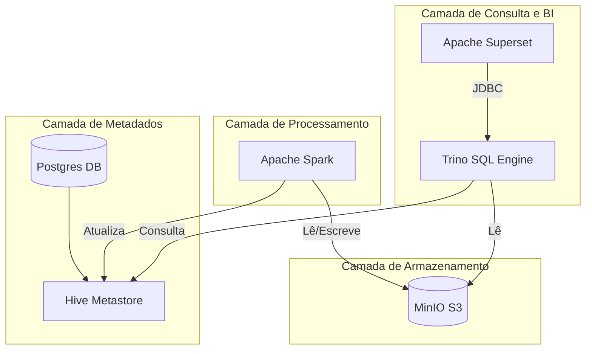

# Capítulo 1: Introdução e Arquitetura

O DataLake FB v2 é uma plataforma moderna e escalável para armazenamento, processamento e análise de grandes volumes de dados. Ele foi projetado para ser resiliente, seguro e de fácil manutenção, utilizando tecnologias de ponta do ecossistema de Big Data.

## 1. Visão Geral
O objetivo principal é centralizar dados de diversas fontes (bancos relacionais, streams, arquivos), transformá-los em um formato otimizado para leitura (Apache Iceberg) e disponibilizá-los para ferramentas de BI e análise ad-hoc com baixa latência.

A arquitetura desacopla computação e armazenamento:
- **Armazenamento:** MinIO (Object Storage compatível com S3).
- **Metadados:** Hive Metastore e PostgreSQL.
- **Processamento:** Apache Spark.
- **Consulta:** Trino (PrestoSQL).
- **Visualização:** Apache Superset.

## 2. Tecnologias Principais

### Armazenamento e Formato de Dados
- **MinIO:** Atua como a camada de armazenamento persistente. Simula o S3 AWS localmente. Todos os dados brutos e processados residem aqui em buckets.
- **Apache Iceberg:** Formato de tabela aberta para grandes datasets analíticos. Traz transações ACID, time travel (viagem no tempo), e evolução de schema segura para o Data Lake.

### Processamento e Catálogo
- **Apache Spark:** A "engine" de força bruta. Usado para ingestão pesada, transformações complexas (ETL) e manutenção de tabelas Iceberg (compactação, expiração de snapshots).
- **Hive Metastore:** Gerencia os metadados técnicos das tabelas, permitindo que Spark e Trino saibam onde os dados estão no MinIO.

### Camada de Consumo
- **Trino (anteriormente PrestoSQL):** Motor de consulta SQL distribuído de alto desempenho. Permite consultas interativas rápidas sobre os dados no Iceberg sem a necessidade de mover dados.
- **Apache Superset:** Plataforma de exploração de dados e visualização. Conecta-se ao Trino para criar dashboards interativos e gráficos.

### Infraestrutura e Suporte
- **Docker & Docker Compose:** Todo o stack roda em containers, garantindo reprodutibilidade e isolamento.
- **PostgreSQL:** Banco de dados de backend para o Hive Metastore, Superset e Gitea.
- **Gitea:** Controle de versão interno para código e configurações.

## 3. Diagrama de Arquitetura

O diagrama abaixo ilustra como os componentes interagem:

## 4. Fluxo de Dados Típico

1.  **Ingestão:** Scripts Python (`src/ingest_iceberg.py`) usam Spark para ler dados da origem e escrever no MinIO em formato Iceberg.
2.  **Registro:** O Spark comunica-se com o Hive Metastore para registrar a nova tabela ou atualizar metadados de uma existente.
3.  **Consulta:** Um analista acessa o Superset ou conecta um cliente DBeaver ao Trino.
4.  **Execução:** O Trino consulta o Hive Metastore para localizar os arquivos parquet no MinIO e retorna os resultados para o usuário.

[Próximo: Instalação e Configuração](./02_instalacao_configuracao.md)
